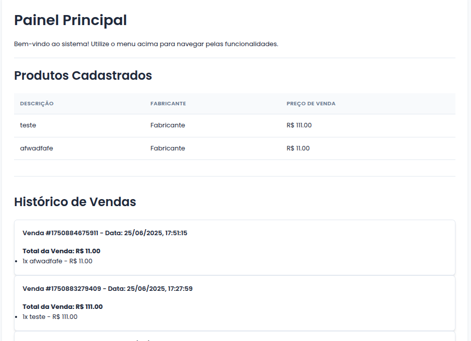
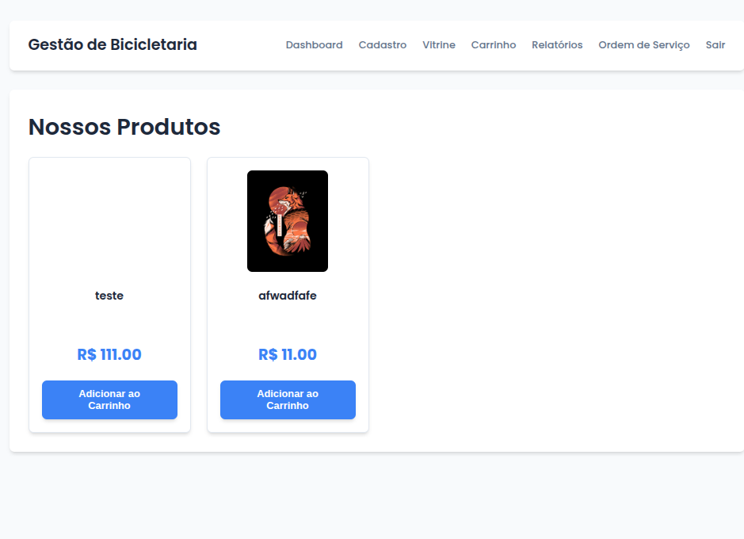
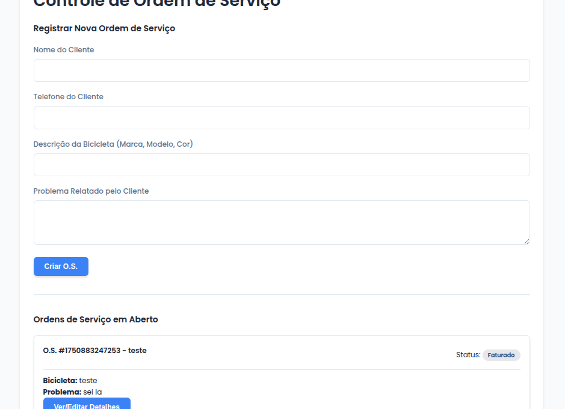

# 🚲 Sistema de Gestão para Bicicletaria


Aplicação web front-end completa desenvolvida como projeto acadêmico, simulando um sistema de gestão para uma bicicletaria. O sistema permite o cadastro de produtos e serviços, um fluxo de vendas com carrinho de compras, geração de relatórios e um módulo de Ordem de Serviço, tudo operando no lado do cliente com persistência de dados via Web Storage.

---

## 📸 Screenshots

| Dashboard Principal | Vitrine de Produtos | Ordem de Serviço |
| :---: | :---: | :---: |
|  |  |  |

*(**Instrução:** Tire screenshots das principais telas do seu sistema, adicione os arquivos de imagem à pasta do seu projeto e substitua os links acima pelo caminho correto para cada imagem.)*

---

## ✨ Funcionalidades Principais

O projeto foi desenvolvido em 4 Sprints, resultando nas seguintes funcionalidades:

* **Autenticação:** Simulação de tela de login e proteção de rotas internas.
* **Dashboard:** Painel principal com resumos de produtos cadastrados e histórico de vendas.
* **Gestão de Itens:** Cadastro de Produtos e Serviços, incluindo a funcionalidade de upload de imagem (salva em Base64).
* **Ponto de Venda (PDV):**
    * **Vitrine** interativa para exibição dos produtos em formato de cards.
    * **Carrinho de Compras** totalmente funcional.
    * **Fluxo de Venda** com captura de dados adicionais (vendedor, forma de pagamento) através de um modal.
* **Relatórios:** Geração de um relatório de vendas detalhado com filtros dinâmicos por descrição e vendedor.
* **Ordem de Serviço (O.S.):**
    * Criação de novas Ordens de Serviço com dados do cliente e da bicicleta.
    * Gestão completa da O.S., permitindo adicionar/remover peças e serviços.
    * Controle de status do serviço (Aberto, Em Andamento, Finalizado, etc.).
    * Integração total com o módulo de vendas para faturamento da O.S.
* **Persistência de Dados:** Todos os dados (produtos, vendas, O.S., etc.) são salvos no `localStorage` do navegador, mantendo o estado da aplicação entre sessões.

---

## 🛠️ Tecnologias Utilizadas

Este projeto foi construído exclusivamente com tecnologias web padrão, sem o uso de frameworks.

* **HTML5:** Para a estruturação semântica do conteúdo.
* **CSS3:** Para a estilização moderna e minimalista, utilizando Flexbox, Grid e Variáveis CSS.
* **JavaScript (ES6+):** Para toda a lógica da aplicação, manipulação do DOM, gestão de estado e interatividade.

---

## 🚀 Como Executar o Projeto

Como este é um projeto puramente front-end, não há necessidade de um processo de build ou de um servidor complexo.

**Opção 1: Abrindo o arquivo diretamente**

1.  Clone este repositório para a sua máquina local:
    ```bash
    git clone [LINK-PARA-SEU-REPOSITORIO.git]
    ```
2.  Navegue até a pasta do projeto.
3.  Abra o arquivo `login.html` em qualquer navegador moderno (Chrome, Firefox, Edge).

**Opção 2: Usando um Servidor Local (Recomendado)**

Para uma melhor experiência e para evitar possíveis problemas com requisições de arquivos locais, use um servidor de desenvolvimento simples. Se você usa o Visual Studio Code, a extensão **Live Server** é perfeita para isso.

1.  Instale a extensão [Live Server](https://marketplace.visualstudio.com/items?itemName=ritwickdey.LiveServer) no VS Code.
2.  Abra a pasta do projeto no VS Code.
3.  Clique com o botão direito no arquivo `login.html` e selecione **"Open with Live Server"**.

O usuário de teste para acesso ao sistema é:
* **Email:** `admin@email.com`
* **Senha:** `admin123`

---

## 📁 Estrutura do Projeto

```
/
|-- css/
|   |-- style.css
|-- js/
|   |-- carrinho.js
|   |-- login.js
|   |-- os.js
|   |-- relatorio.js
|   |-- script.js
|   |-- verifica-login.js
|
|-- cadastro-produto.html
|-- carrinho.html
|-- index.html
|-- login.html
|-- os.html
|-- relatorio-vendas.html
|-- vitrine.html
|-- README.md
```
